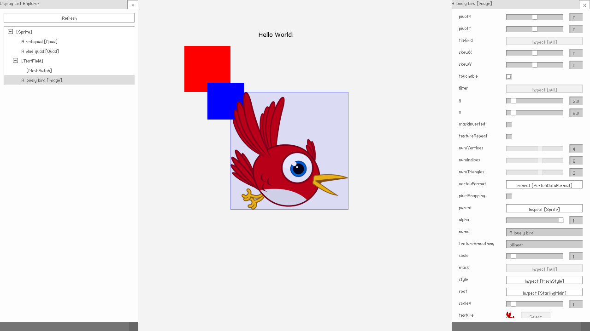

# Starling Inspector

The Starling Inspector is an AS3 library which will enable display list inspection of your [Starling Framework](https://github.com/Gamua/Starling-Framework) project. This project is relying on the Starling version of [Feathers UI](https://github.com/feathersui/feathersui-starling).

👉 Beware: the project is currently in its early stage, you might encounter issues while using it.



## ⭐ Key features

- Inspect your scene without using a debugger
- Tweak your scene objects live
- Customize your inspector if needed

## ▶️ Try it!

Go to the [demo](./demo/) folder, configure the project & run it or if you get the latest release, the demo binary should be available in the archive.

## ⌨️ How to use?

### 🎛️ Display List Inspector

In order to start exploring a `Display Object Container`, check the following snippet:

```actionscript
private var _scene:Sprite; // Your scene root object
private var _inspectorLayer:Sprite;

public function setupInspector()
{
	// Setup the inspector layer
	_inspectorLayer = new Sprite();
	addChild(_inspectorLayer);

	// Setup the inspector configuration
	InspectorConfiguration.ROOT_LAYER = _inspectorLayer;

	// Create the Display List Inspector Panel
	_displayListInspectorPanel = new DisplayListInspectorPanel(_scene, true);
	_displayListInspectorPanel.height = Starling.current.nativeStage.stageHeight;
	_inspectorLayer.addChild(_displayListInspectorPanel);
}
```
Feel free to checkout the demo for more usage examples.

### 🖌️ Customize inspector styles

The style of the inspector is based on your current `Feathers UI` theme (see [Feathers themes](https://feathersui.com/learn/as3-starling/themes)).
For further customization, check the following class: `InspectorConfiguration`.

```actionscript
// Change the style used for panel title
InspectorConfiguration.STYLE_NAME_LABEL_PANEL_TITLE = "custom-inspector-panel-title-style";

// Change the padding between components
InspectorConfiguration.COMPONENTS_PADDING = 12;
```

## 📦 How to install?

- Use the `.swc` file provided in each release.

or

- Checkout this repository & add `src` folder in your `classpath` or copy paste the content of the `src` folder in your source folder.

Don't forget to include dependencies (see below).

## 🖇 Dependencies

- [Feathers UI (Starling)](https://github.com/feathersui/feathersui-starling) 4.x
- [Adobe AIR SDK](https://airsdk.harman.com)
- AS3 Signal (see `as3-signal.swc` in library folder)