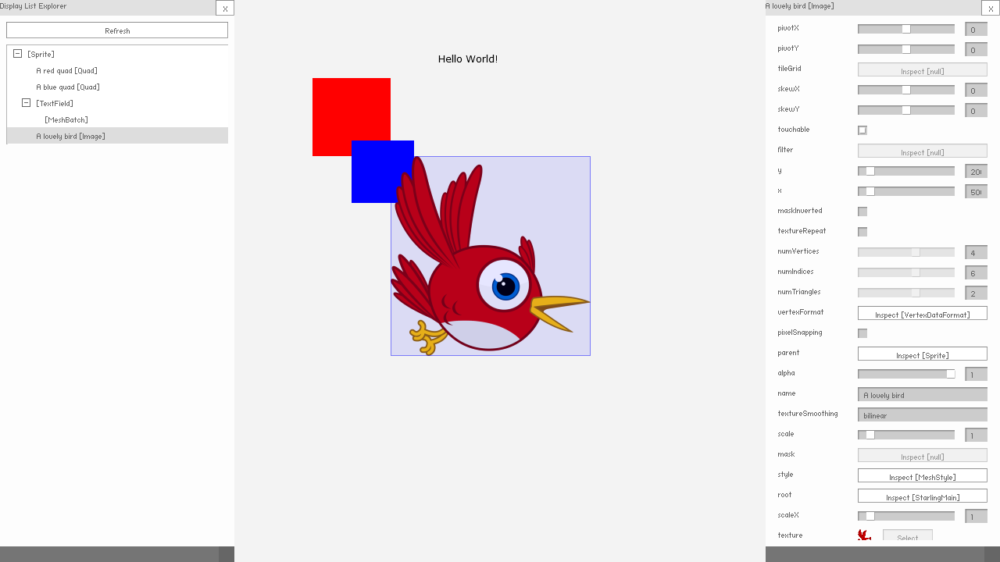

# Starling Inspector - Demo

by Aurélien Da Campo ([Adolio](https://twitter.com/AurelienDaCampo))

## 📍 Introduction

The demo shows the main features provided by the *Starling Inspector* extension.

## 🎶 Resources origin

### Images
- [Starling Framework Logo](https://en.wikipedia.org/wiki/Starling_Framework), Original drawing from Chris Georgenes - Own work (CC BY 4.0)

## 🔨 How to build?

Install [Visual Studio Code](https://code.visualstudio.com/) and [ActionScript & MXML](https://as3mxml.com/#install-extension) and then follow the build procedure provided by the *ActionScript & MXML* extension.